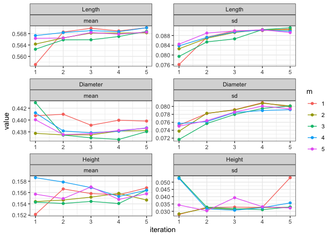

<!-- README.md is generated from README.Rmd. Please edit that file -->

# Multiple Imputation by Super Learning (MISL)

[](https://travis-ci.com/carpenitoThomas/misl)
[](https://codecov.io/gh/carpenitoThomas/misl)
[](https://www.gnu.org/licenses/gpl-3.0)

The goal of MISL (Multiple Imputation by Super Learning) is to create
multiply imputed datasets using the super learning framework. This
package builds heavily off of the `sl3` and `mice` packages.

## Installation

You can install the released version of misl from
[CRAN](https://CRAN.R-project.org) with:

``` r
install.packages("misl")
```

And the development version from [GitHub](https://github.com/) with:

``` r
# install.packages("devtools")
devtools::install_github("carpenitoThomas/misl")
```

## Example

Here’s an example with the nhanes data in which we use `misl()`
imputation and then pool the results:

``` r
library(misl)

misl_imp <- misl(abalone, maxit = 5, m = 5, quiet = FALSE,
                  con_method = c("Lrnr_mean", "Lrnr_glm_fast", "Lrnr_earth", "Lrnr_glmnet", "Lrnr_polspline"),
                  bin_method = c("Lrnr_mean", "Lrnr_earth", "Lrnr_glm_fast"),
                  cat_method = c("Lrnr_independent_binomial", "Lrnr_mean"))
#> [1] "Imputing dataset: 1"
#> [1] "Imputing iteration: 1"
#> [1] "Imputing: Sex"
#> [1] "Imputing: Length"
#> [1] "Imputing: Diameter"
#> [1] "Imputing: Height"
#> [1] "Imputing: Whole_Weight"
#> [1] "Imputing: Older_12"
#> [1] "Imputing iteration: 2"
#> [1] "Imputing: Sex"
#> [1] "Imputing: Length"
#> [1] "Imputing: Diameter"
#> [1] "Imputing: Height"
#> [1] "Imputing: Whole_Weight"
#> [1] "Imputing: Older_12"
#> [1] "Imputing iteration: 3"
#> [1] "Imputing: Sex"
#> [1] "Imputing: Length"
#> [1] "Imputing: Diameter"
#> [1] "Imputing: Height"
#> [1] "Imputing: Whole_Weight"
#> [1] "Imputing: Older_12"
#> [1] "Imputing iteration: 4"
#> [1] "Imputing: Sex"
#> [1] "Imputing: Length"
#> [1] "Imputing: Diameter"
#> [1] "Imputing: Height"
#> [1] "Imputing: Whole_Weight"
#> [1] "Imputing: Older_12"
#> [1] "Imputing iteration: 5"
#> [1] "Imputing: Sex"
#> [1] "Imputing: Length"
#> [1] "Imputing: Diameter"
#> [1] "Imputing: Height"
#> [1] "Imputing: Whole_Weight"
#> [1] "Imputing: Older_12"
#> [1] "Imputing dataset: 2"
#> [1] "Imputing iteration: 1"
#> [1] "Imputing: Sex"
#> [1] "Imputing: Length"
#> [1] "Imputing: Diameter"
#> [1] "Imputing: Height"
#> [1] "Imputing: Whole_Weight"
#> [1] "Imputing: Older_12"
#> [1] "Imputing iteration: 2"
#> [1] "Imputing: Sex"
#> [1] "Imputing: Length"
#> [1] "Imputing: Diameter"
#> [1] "Imputing: Height"
#> [1] "Imputing: Whole_Weight"
#> [1] "Imputing: Older_12"
#> [1] "Imputing iteration: 3"
#> [1] "Imputing: Sex"
#> [1] "Imputing: Length"
#> [1] "Imputing: Diameter"
#> [1] "Imputing: Height"
#> [1] "Imputing: Whole_Weight"
#> [1] "Imputing: Older_12"
#> [1] "Imputing iteration: 4"
#> [1] "Imputing: Sex"
#> [1] "Imputing: Length"
#> [1] "Imputing: Diameter"
#> [1] "Imputing: Height"
#> [1] "Imputing: Whole_Weight"
#> [1] "Imputing: Older_12"
#> [1] "Imputing iteration: 5"
#> [1] "Imputing: Sex"
#> [1] "Imputing: Length"
#> [1] "Imputing: Diameter"
#> [1] "Imputing: Height"
#> [1] "Imputing: Whole_Weight"
#> [1] "Imputing: Older_12"
#> [1] "Imputing dataset: 3"
#> [1] "Imputing iteration: 1"
#> [1] "Imputing: Sex"
#> [1] "Imputing: Length"
#> [1] "Imputing: Diameter"
#> [1] "Imputing: Height"
#> [1] "Imputing: Whole_Weight"
#> [1] "Imputing: Older_12"
#> [1] "Imputing iteration: 2"
#> [1] "Imputing: Sex"
#> [1] "Imputing: Length"
#> [1] "Imputing: Diameter"
#> [1] "Imputing: Height"
#> [1] "Imputing: Whole_Weight"
#> [1] "Imputing: Older_12"
#> [1] "Imputing iteration: 3"
#> [1] "Imputing: Sex"
#> [1] "Imputing: Length"
#> [1] "Imputing: Diameter"
#> [1] "Imputing: Height"
#> [1] "Imputing: Whole_Weight"
#> [1] "Imputing: Older_12"
#> [1] "Imputing iteration: 4"
#> [1] "Imputing: Sex"
#> [1] "Imputing: Length"
#> [1] "Imputing: Diameter"
#> [1] "Imputing: Height"
#> [1] "Imputing: Whole_Weight"
#> [1] "Imputing: Older_12"
#> [1] "Imputing iteration: 5"
#> [1] "Imputing: Sex"
#> [1] "Imputing: Length"
#> [1] "Imputing: Diameter"
#> [1] "Imputing: Height"
#> [1] "Imputing: Whole_Weight"
#> [1] "Imputing: Older_12"
#> [1] "Imputing dataset: 4"
#> [1] "Imputing iteration: 1"
#> [1] "Imputing: Sex"
#> [1] "Imputing: Length"
#> [1] "Imputing: Diameter"
#> [1] "Imputing: Height"
#> [1] "Imputing: Whole_Weight"
#> [1] "Imputing: Older_12"
#> [1] "Imputing iteration: 2"
#> [1] "Imputing: Sex"
#> [1] "Imputing: Length"
#> [1] "Imputing: Diameter"
#> [1] "Imputing: Height"
#> [1] "Imputing: Whole_Weight"
#> [1] "Imputing: Older_12"
#> [1] "Imputing iteration: 3"
#> [1] "Imputing: Sex"
#> [1] "Imputing: Length"
#> [1] "Imputing: Diameter"
#> [1] "Imputing: Height"
#> [1] "Imputing: Whole_Weight"
#> [1] "Imputing: Older_12"
#> [1] "Imputing iteration: 4"
#> [1] "Imputing: Sex"
#> [1] "Imputing: Length"
#> [1] "Imputing: Diameter"
#> [1] "Imputing: Height"
#> [1] "Imputing: Whole_Weight"
#> [1] "Imputing: Older_12"
#> [1] "Imputing iteration: 5"
#> [1] "Imputing: Sex"
#> [1] "Imputing: Length"
#> [1] "Imputing: Diameter"
#> [1] "Imputing: Height"
#> [1] "Imputing: Whole_Weight"
#> [1] "Imputing: Older_12"
#> [1] "Imputing dataset: 5"
#> [1] "Imputing iteration: 1"
#> [1] "Imputing: Sex"
#> [1] "Imputing: Length"
#> [1] "Imputing: Diameter"
#> [1] "Imputing: Height"
#> [1] "Imputing: Whole_Weight"
#> [1] "Imputing: Older_12"
#> [1] "Imputing iteration: 2"
#> [1] "Imputing: Sex"
#> [1] "Imputing: Length"
#> [1] "Imputing: Diameter"
#> [1] "Imputing: Height"
#> [1] "Imputing: Whole_Weight"
#> [1] "Imputing: Older_12"
#> [1] "Imputing iteration: 3"
#> [1] "Imputing: Sex"
#> [1] "Imputing: Length"
#> [1] "Imputing: Diameter"
#> [1] "Imputing: Height"
#> [1] "Imputing: Whole_Weight"
#> [1] "Imputing: Older_12"
#> [1] "Imputing iteration: 4"
#> [1] "Imputing: Sex"
#> [1] "Imputing: Length"
#> [1] "Imputing: Diameter"
#> [1] "Imputing: Height"
#> [1] "Imputing: Whole_Weight"
#> [1] "Imputing: Older_12"
#> [1] "Imputing iteration: 5"
#> [1] "Imputing: Sex"
#> [1] "Imputing: Length"
#> [1] "Imputing: Diameter"
#> [1] "Imputing: Height"
#> [1] "Imputing: Whole_Weight"
#> [1] "Imputing: Older_12"
#> Warning in if (cat_method == "Lrnr_mean" & length(cat_method == 1)) {: the
#> condition has length > 1 and only the first element will be used

#> Warning in if (cat_method == "Lrnr_mean" & length(cat_method == 1)) {: the
#> condition has length > 1 and only the first element will be used

#> Warning in if (cat_method == "Lrnr_mean" & length(cat_method == 1)) {: the
#> condition has length > 1 and only the first element will be used

#> Warning in if (cat_method == "Lrnr_mean" & length(cat_method == 1)) {: the
#> condition has length > 1 and only the first element will be used

#> Warning in if (cat_method == "Lrnr_mean" & length(cat_method == 1)) {: the
#> condition has length > 1 and only the first element will be used

#> Warning in if (cat_method == "Lrnr_mean" & length(cat_method == 1)) {: the
#> condition has length > 1 and only the first element will be used

#> Warning in if (cat_method == "Lrnr_mean" & length(cat_method == 1)) {: the
#> condition has length > 1 and only the first element will be used

#> Warning in if (cat_method == "Lrnr_mean" & length(cat_method == 1)) {: the
#> condition has length > 1 and only the first element will be used

#> Warning in if (cat_method == "Lrnr_mean" & length(cat_method == 1)) {: the
#> condition has length > 1 and only the first element will be used

#> Warning in if (cat_method == "Lrnr_mean" & length(cat_method == 1)) {: the
#> condition has length > 1 and only the first element will be used

#> Warning in if (cat_method == "Lrnr_mean" & length(cat_method == 1)) {: the
#> condition has length > 1 and only the first element will be used

#> Warning in if (cat_method == "Lrnr_mean" & length(cat_method == 1)) {: the
#> condition has length > 1 and only the first element will be used

#> Warning in if (cat_method == "Lrnr_mean" & length(cat_method == 1)) {: the
#> condition has length > 1 and only the first element will be used

#> Warning in if (cat_method == "Lrnr_mean" & length(cat_method == 1)) {: the
#> condition has length > 1 and only the first element will be used

#> Warning in if (cat_method == "Lrnr_mean" & length(cat_method == 1)) {: the
#> condition has length > 1 and only the first element will be used

#> Warning in if (cat_method == "Lrnr_mean" & length(cat_method == 1)) {: the
#> condition has length > 1 and only the first element will be used

#> Warning in if (cat_method == "Lrnr_mean" & length(cat_method == 1)) {: the
#> condition has length > 1 and only the first element will be used

#> Warning in if (cat_method == "Lrnr_mean" & length(cat_method == 1)) {: the
#> condition has length > 1 and only the first element will be used

#> Warning in if (cat_method == "Lrnr_mean" & length(cat_method == 1)) {: the
#> condition has length > 1 and only the first element will be used

#> Warning in if (cat_method == "Lrnr_mean" & length(cat_method == 1)) {: the
#> condition has length > 1 and only the first element will be used

#> Warning in if (cat_method == "Lrnr_mean" & length(cat_method == 1)) {: the
#> condition has length > 1 and only the first element will be used

#> Warning in if (cat_method == "Lrnr_mean" & length(cat_method == 1)) {: the
#> condition has length > 1 and only the first element will be used

#> Warning in if (cat_method == "Lrnr_mean" & length(cat_method == 1)) {: the
#> condition has length > 1 and only the first element will be used

#> Warning in if (cat_method == "Lrnr_mean" & length(cat_method == 1)) {: the
#> condition has length > 1 and only the first element will be used

#> Warning in if (cat_method == "Lrnr_mean" & length(cat_method == 1)) {: the
#> condition has length > 1 and only the first element will be used

misl_modeling <- lapply(misl_imp, function(y){
  stats::lm(Whole_Weight ~ Sex + Length + Diameter + Height + Older_12, data = y$datasets)
})

summary(mice::pool(misl_modeling), conf.int = TRUE)
#>          term    estimate   std.error  statistic         df      p.value
#> 1 (Intercept) -1.02928344 0.017108950 -60.160526  594.33585 0.000000e+00
#> 2        SexI -0.02642959 0.008727736  -3.028230  190.52111 2.800730e-03
#> 3        SexM  0.01429277 0.007167249   1.994178  148.20919 4.796700e-02
#> 4      Length  1.81666106 0.141152897  12.870165 1649.38050 0.000000e+00
#> 5    Diameter  1.51370552 0.251721676   6.013410   13.92595 3.252826e-05
#> 6      Height  1.97544577 0.525044539   3.762435    4.33570 1.704645e-02
#> 7    Older_12  0.04717812 0.007059917   6.682532  115.35420 8.734742e-10
#>           2.5 %      97.5 %
#> 1 -1.0628847889 -0.99568208
#> 2 -0.0436449957 -0.00921419
#> 3  0.0001295726  0.02845597
#> 4  1.5398033019  2.09351882
#> 5  0.9735467558  2.05386428
#> 6  0.5611411060  3.38975044
#> 7  0.0331942380  0.06116200
```

We can also look at the traceplot of the imputations as well:

``` r
traceplot(misl_imp)
```



This package also supports paralellization with the `future` package.
One can choose to paralellize either the outside creation of datasets or
the learners in the super learner library (or both\!). The following
snippet explains how this can be accomplished with four test-case
scenarios (with an assumption that our computer has 8 cores):

``` r
library(future)

# Sequential dataset processessing, Sequential super learning  (default)
plan(list(sequential,sequential))
seq_seq <- misl(abalone)

# Sequential dataset processessing, paralell super learning (8) 
plan(list(sequential,tweak(multisession, workers = 8)))
seq_par <- misl(abalone)

# Paralelle dataset processessing (8), sequential super learning 
plan(list(tweak(multisession, workers = 5), sequential))
par_seq <- misl(abalone)

# paralell dataset processessing (4), paralell super learning (2) 
plan(list(tweak(multisession, workers = 4),tweak(multisession, workers = 2)))
par_par <- misl(abalone)

# paralell dataset processing to ensure you don't overload your computer
plan(list(tweak(multisession, workers = availableCores() %/% 4),tweak(multisession, workers = 4)))
par_safe <- misl(abalone)
```

Reminder, paralellizing code is not a silver bullet to automate making
runtime processes faster. Make sure you have an understanding of the
capacity of your computer. Further information about the topology of
running code in paralell can be found in the future package.
