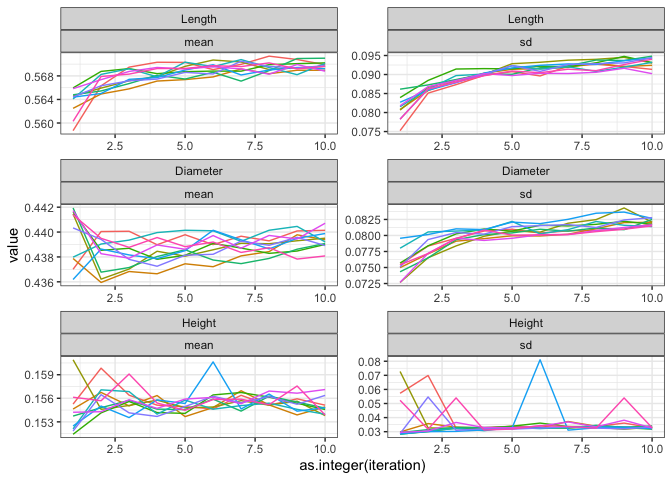

<!-- README.md is generated from README.Rmd. Please edit that file -->

# misl <a href='/'></a>

[](https://www.gnu.org/licenses/gpl-3.0)

## Multiple Imputation by Super Learning

The goal of MISL (Multiple Imputation by Super Learning) is to create
multiply imputed datasets using the super learning framework. This
package builds heavily off of the `sl3` and `mice` packages.

This method has been submitted for publication and is currently in
review.

## Installation

The MISL algorithm is not yet available on CRAN; instead, please use the
development version available here on Github. To download the
development version use:

``` r
install.packages("devtools")
devtools::install_github("carpenitoThomas/misl")
```

## Example

Here’s an example with abalone data in which we use `misl()` imputation
and then pool the results:

``` r
library(misl)
set.seed(123)

misl_imp <- misl(abalone, maxit = 2, m = 2, quiet = TRUE,
                  con_method = c("Lrnr_glm_fast", "Lrnr_mean"),
                  bin_method = c("Lrnr_mean", "Lrnr_glm_fast"),
                  cat_method = c("Lrnr_independent_binomial", "Lrnr_mean"))

misl_modeling <- lapply(misl_imp, function(y){
  stats::lm(Whole_Weight ~ Sex + Length + Diameter + Height + Older_12, data = y$datasets)
})

summary(mice::pool(misl_modeling), conf.int = TRUE)
#>          term     estimate   std.error   statistic        df      p.value
#> 1 (Intercept) -0.887693966 0.019116347 -46.4363815 57.552274 0.000000e+00
#> 2        SexI -0.062548078 0.009443352  -6.6235039 42.294646 4.878313e-08
#> 3        SexM -0.004023852 0.010026339  -0.4013281  4.032384 7.085381e-01
#> 4      Length  1.098477222 0.323511367   3.3954826  1.663517 9.867079e-02
#> 5    Diameter  1.779552767 0.261800553   6.7973606  4.387888 1.738168e-03
#> 6      Height  2.966731278 0.683115692   4.3429412  1.043598 1.361443e-01
#> 7    Older_12  0.062752546 0.013503397   4.6471674  1.788729 5.333936e-02
#>          2.5 %      97.5 %
#> 1 -0.925965830 -0.84942210
#> 2 -0.081601601 -0.04349455
#> 3 -0.031773486  0.02372578
#> 4 -0.601374698  2.79832914
#> 5  1.077331080  2.48177446
#> 6 -4.901370957 10.83483351
#> 7 -0.002445918  0.12795101
```

We can also look at the traceplot of the imputations as
well:

``` r
misl::trace_plot(misl_imp)
```


